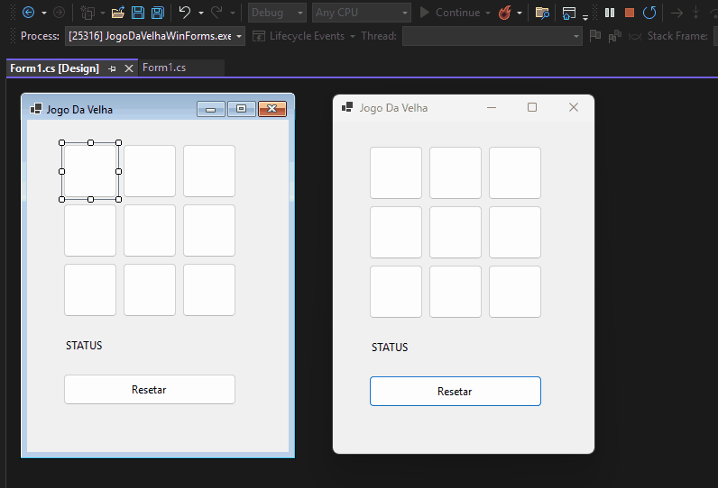

### ❌ Jogo da Velha (Tic-Tac-Toe) - WinForms

Um projeto clássico de Jogo da Velha desenvolvido em C# utilizando Windows Forms. O foco deste projeto foi a aplicação de lógica de matrizes, manipulação dinâmica de componentes de UI e controle de estado de jogo.

---

#### 🚀 Funcionalidades

* **Tabuleiro Dinâmico:** Uso de um único evento para gerenciar múltiplos botões.
* **Verificação de Vitória:** Lógica baseada em matriz 3x3 para conferência de linhas, colunas e diagonais.
* **Gestão de Turnos:** Alternância automática entre jogadores X e O.
* **Sistema de Empate:** Detecção automática quando não há mais movimentos possíveis.
* **Reset Inteligente:** Função para limpar o tabuleiro sem afetar outros elementos da interface.

#### 🛠️ Tecnologias Utilizadas

* **Linguagem:** C#
* **Framework:** .NET / Windows Forms
* **Ambiente:** Visual Studio 2022

#### 📝 Como funciona o código?

A lógica principal reside na função `VerificarVencedor()`, que captura o estado atual dos botões e os organiza em uma matriz bidimensional. Isso permite que a validação de vitória seja feita através de loops e verificações de coordenadas, tornando o código mais limpo e escalável.

---

*Este projeto faz parte da minha jornada de estudos em Desenvolvimento FullStack e Game Dev.*

